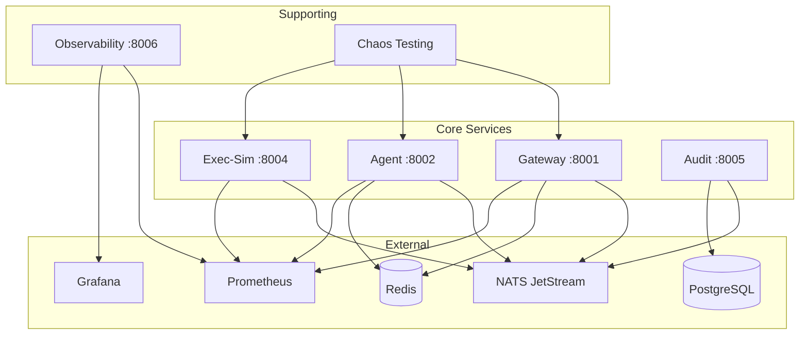

# Service Dependencies

## Dependency Graph



## Service Startup Order

```yaml
1. Infrastructure (must start first):
   - nats
   - redis (if enabled)
   - postgres (if enabled)

2. Stream Initialization:
   - nats-init (creates streams/consumers)

3. Core Services (can start in parallel):
   - gateway
   - agent
   - exec-sim
   - audit

4. Monitoring (optional):
   - prometheus
   - grafana
   - observability
```

## Runtime Dependencies

### Gateway Service

| Dependency | Required | Purpose | Fallback |
|------------|----------|---------|----------|
| NATS | ✅ Yes | Event publishing | Service fails |
| Redis | ❌ No | Idempotency cache | In-memory cache |
| Prometheus | ❌ No | Metrics collection | No metrics |

**Environment Variables:**
```bash
NATS_URL=nats://nats:4222       # Required
NATS_STREAM=trading-events      # Required
API_KEY_HMAC_SECRET=***          # Required for auth
REDIS_URL=redis://redis:6379    # Optional
```

### Agent Service

| Dependency | Required | Purpose | Fallback |
|------------|----------|---------|----------|
| NATS | ✅ Yes | Event consumption/publishing | Service fails |
| Redis | ❌ No | State cache | In-memory |
| Prometheus | ❌ No | Metrics | No metrics |

**Environment Variables:**
```bash
NATS_URL=nats://nats:4222       # Required
NATS_STREAM=trading-events      # Required
NATS_DURABLE=agent-consumer     # Required
RISK_LIMITS_ENABLED=true        # Optional
```

### Exec-Sim Service

| Dependency | Required | Purpose | Fallback |
|------------|----------|---------|----------|
| NATS | ✅ Yes | Order consumption | Service fails |
| Market Data | ❌ No | Price feeds | Uses static prices |
| Prometheus | ❌ No | Metrics | No metrics |

**Environment Variables:**
```bash
NATS_URL=nats://nats:4222         # Required
NATS_STREAM=trading-events        # Required
NATS_DURABLE=exec-sim-consumer    # Required
SIMULATE_SLIPPAGE=true            # Optional
SIMULATE_PARTIAL_FILLS=true       # Optional
```

### Audit Service

| Dependency | Required | Purpose | Fallback |
|------------|----------|---------|----------|
| NATS | ✅ Yes | Event consumption | Service fails |
| PostgreSQL | ❌ No | Persistent storage | SQLite |
| Prometheus | ❌ No | Metrics | No metrics |

**Environment Variables:**
```bash
NATS_URL=nats://nats:4222         # Required
NATS_STREAM=trading-events        # Required
DATABASE_URL=postgresql://...     # Optional (uses SQLite)
AUDIT_RETENTION_DAYS=90           # Optional
```

## Python Package Dependencies

### Core Libraries (All Services)
```txt
# Async framework
fastapi==0.104.1
uvicorn==0.24.0
aiohttp==3.9.1

# NATS messaging
nats-py==2.6.0

# Validation
pydantic==2.5.0
jsonschema==4.20.0

# Observability
prometheus-client==0.19.0
structlog==23.2.0

# Utilities
python-dotenv==1.0.0
python-dateutil==2.8.2
```

### Service-Specific

**Gateway:**
```txt
# Security
cryptography==41.0.7
python-jose==3.3.0

# Rate limiting
slowapi==0.1.9
```

**Agent:**
```txt
# Analysis
numpy==1.24.3
pandas==2.1.3
scikit-learn==1.3.2
```

**Exec-Sim:**
```txt
# Market simulation
random2==1.0.1
```

**Audit:**
```txt
# Database
sqlalchemy==2.0.23
alembic==1.12.1
psycopg2-binary==2.9.9  # For PostgreSQL
```

## Infrastructure Requirements

### NATS JetStream
- Version: 2.10+
- Memory: 512MB minimum
- Streams: 1 (trading-events)
- Consumers: 3 (agent, exec-sim, audit)
- Retention: 7 days default

### Redis (Optional)
- Version: 7.0+
- Memory: 256MB minimum
- Purpose: Idempotency cache
- TTL: 24 hours default

### PostgreSQL (Optional)
- Version: 15+
- Memory: 1GB minimum
- Purpose: Audit trail persistence
- Schema: Auto-migrated

### Prometheus
- Version: 2.40+
- Memory: 512MB minimum
- Scrape interval: 15s
- Retention: 15 days

### Grafana
- Version: 9.0+
- Memory: 256MB minimum
- Datasource: Prometheus
- Dashboards: Auto-provisioned

## Network Requirements

### Internal Communication
All services communicate via Docker network `agentic-trading-architecture-full_default`

### Exposed Ports
```yaml
External Access:
  - 8001: Gateway API
  - 8002: Agent API
  - 8004: Exec-Sim API
  - 8005: Audit API
  - 3000: Grafana UI
  - 9090: Prometheus UI

Internal Only:
  - 4222: NATS
  - 6379: Redis
  - 5432: PostgreSQL
```

## Health Check Endpoints

All services must expose:
```http
GET /healthz
Response: {"ok": true, "service": "name", "version": "1.0.0"}
```

Dependencies checked in health:
- NATS connection
- Database connection (if applicable)
- Redis connection (if applicable)

## Graceful Degradation

### NATS Unavailable
- Services enter reconnection loop
- Buffered messages up to 1000
- Exponential backoff: 1s, 2s, 4s, 8s...
- Max reconnect: 60s

### Redis Unavailable
- Falls back to in-memory cache
- Idempotency window reduced to process lifetime
- Warning logged, service continues

### PostgreSQL Unavailable
- Falls back to SQLite (audit service)
- Data persisted locally
- Manual migration required later

### Prometheus Unavailable
- Metrics accumulate in memory
- No data loss for counters
- Gauges show last value

## Upgrade Path

### Zero-Downtime Upgrades
1. Deploy new version alongside old
2. Drain consumers gracefully
3. Switch traffic via load balancer
4. Decommission old version

### Database Migrations
1. Run migrations in separate job
2. Use backward-compatible changes
3. Two-phase for breaking changes

### Message Schema Evolution
1. Add fields as optional
2. Deprecate via documentation
3. Remove after 2 versions

## Resource Recommendations

### Development
```yaml
Total System Requirements:
  CPU: 2 cores
  Memory: 4GB
  Disk: 10GB

Per Service (typical):
  CPU: 0.1 cores
  Memory: 256MB
```

### Production
```yaml
Total System Requirements:
  CPU: 8 cores
  Memory: 16GB
  Disk: 100GB

Per Service (recommended):
  Gateway:
    CPU: 1 core
    Memory: 1GB
    Replicas: 3

  Agent:
    CPU: 2 cores
    Memory: 2GB
    Replicas: 2

  Exec-Sim:
    CPU: 1 core
    Memory: 1GB
    Replicas: 3

  Audit:
    CPU: 0.5 cores
    Memory: 512MB
    Replicas: 1
```

## Dependency Security

### Package Scanning
```bash
# Python packages
pip install safety
safety check

# Docker images
docker scan <image-name>

# License compliance
pip install pip-licenses
pip-licenses --summary
```

### Update Strategy
- Security patches: Immediate
- Minor versions: Weekly
- Major versions: Quarterly
- Breaking changes: Planned migration

## Troubleshooting Dependencies

### NATS Connection Issues
```bash
# Test NATS connectivity
docker run --rm -it --network agentic-trading-architecture-full_default \
  natsio/nats-box:latest \
  nats -s nats://nats:4222 server check connection

# Check stream status
nats -s nats://nats:4222 stream ls
nats -s nats://nats:4222 stream info trading-events
```

### Redis Connection Issues
```bash
# Test Redis connectivity
docker run --rm -it --network agentic-trading-architecture-full_default \
  redis:alpine redis-cli -h redis ping
```

### PostgreSQL Connection Issues
```bash
# Test PostgreSQL connectivity
docker run --rm -it --network agentic-trading-architecture-full_default \
  postgres:alpine psql -h postgres -U postgres -c "SELECT 1"
```

### Service Discovery Issues
```bash
# Check Docker DNS
docker run --rm -it --network agentic-trading-architecture-full_default \
  busybox nslookup gateway

# Check service connectivity
docker run --rm -it --network agentic-trading-architecture-full_default \
  curlimages/curl curl http://gateway:8001/healthz
```

---

**Note**: Keep this document updated when adding new dependencies or changing requirements.