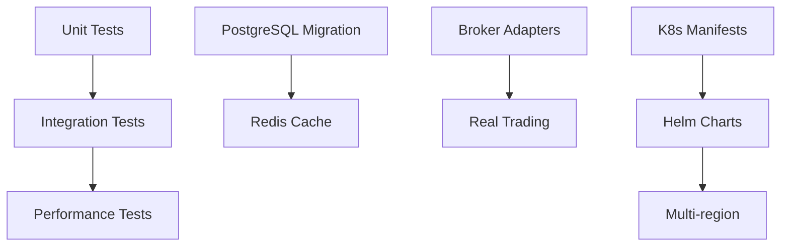

# Task Assignments

**IMPORTANT**: Update this file BEFORE starting work to avoid conflicts.

## How to Claim a Task

1. **Check for conflicts** - Ensure task is "Available"
2. **Update this file** with your name/ID
3. **Commit immediately**:
   ```bash
   git add TASK_ASSIGNMENTS.md
   git commit -m "chore: claiming task - [task name]"
   git push
   ```
4. **Create feature branch**:
   ```bash
   git checkout -b feature/your-task-name
   ```

## Task Status Legend

- 🟢 **Available** - Ready to be claimed
- 🟡 **Claimed** - Someone is working on it
- 🔴 **Blocked** - Waiting on dependencies
- ✅ **Complete** - Merged to main

## Current Sprint Tasks

### High Priority

| Task | Status | Assignee | Branch | Started | ETA | Notes |
|------|--------|----------|--------|---------|-----|-------|
| Unit tests for gateway | 🟢 Available | - | - | - | 2 days | Test webhook validation, HMAC auth |
| Unit tests for exec-sim | 🟢 Available | - | - | - | 2 days | Test order processing, fills |
| Unit tests for agent | 🟢 Available | - | - | - | 2 days | Test decision logic |
| Fix chaos container build | 🟢 Available | - | - | - | 1 hour | Add setuptools to requirements |
| Document all env vars | 🟢 Available | - | - | - | 2 hours | Update .env.example |

### Medium Priority

| Task | Status | Assignee | Branch | Started | ETA | Notes |
|------|--------|----------|--------|---------|-----|-------|
| Alpaca broker adapter | 🟢 Available | - | - | - | 3 days | repos/at-broker-alpaca/ |
| Interactive Brokers adapter | 🟢 Available | - | - | - | 4 days | repos/at-broker-ib/ |
| Stop-loss order type | 🟢 Available | - | - | - | 1 day | Update schema, add to exec-sim |
| Integration test suite | 🟢 Available | - | - | - | 3 days | Service-to-service tests |
| PostgreSQL migration | 🟢 Available | - | - | - | 2 days | Migrate from SQLite |
| Redis idempotency cache | 🟢 Available | - | - | - | 1 day | Replace in-memory cache |

### Low Priority

| Task | Status | Assignee | Branch | Started | ETA | Notes |
|------|--------|----------|--------|---------|-----|-------|
| WebSocket streaming | 🟢 Available | - | - | - | 3 days | Real-time order updates |
| Grafana dashboards | 🟢 Available | - | - | - | 2 days | Service-specific dashboards |
| OpenAPI documentation | 🟢 Available | - | - | - | 1 day | Swagger for all endpoints |
| Performance benchmarks | 🟢 Available | - | - | - | 2 days | Load testing with k6 |
| Circuit breakers | 🟢 Available | - | - | - | 2 days | Add py-breaker |
| Kubernetes manifests | 🟢 Available | - | - | - | 3 days | Deployments, Services, ConfigMaps |

## Backlog (Not Started)

### Infrastructure
- [ ] Helm chart creation
- [ ] Terraform for cloud resources
- [ ] CI/CD with GitHub Actions
- [ ] Multi-region deployment
- [ ] Service mesh (Istio/Linkerd)

### Features
- [ ] Bracket orders
- [ ] Trailing stops
- [ ] Portfolio rebalancing
- [ ] Tax lot tracking
- [ ] Multi-currency support

### Integrations
- [ ] Binance connector
- [ ] Coinbase connector
- [ ] FIX protocol support
- [ ] TradingView alerts
- [ ] Discord notifications

### ML/AI
- [ ] Price prediction models
- [ ] Sentiment analysis
- [ ] Risk scoring
- [ ] Anomaly detection
- [ ] Reinforcement learning agent

## Completed Tasks

| Task | Completed By | Date | PR |
|------|--------------|------|-----|
| HMAC authentication | AI-Assistant-1 | 2025-09-23 | Initial |
| JetStream integration | AI-Assistant-1 | 2025-09-23 | Initial |
| Consumer resilience | AI-Assistant-1 | 2025-09-23 | Initial |
| Schema validation | AI-Assistant-1 | 2025-09-23 | Initial |
| Documentation suite | AI-Assistant-1 | 2025-09-23 | Initial |

## Task Dependencies



## Coordination Guidelines

### Daily Sync (Async)
Post in Slack/Discord:
- What you completed yesterday
- What you're working on today
- Any blockers

### Weekly Planning
- Review completed tasks
- Update priorities
- Assign new tasks
- Update ROADMAP.md

### Merge Conflicts
1. Pull latest main
2. Rebase your branch
3. Resolve conflicts locally
4. Test thoroughly
5. Push and create PR

## Contact for Questions

### Technical Questions
- Check documentation first (SYSTEM_OVERVIEW.md, CONTRACT.md)
- Search existing code for patterns
- Post in #tech-questions channel

### Task Clarification
- Check ROADMAP.md for context
- Review related tickets/issues
- Ask in #planning channel

### Urgent Issues
- System down: Page on-call
- Security issue: Email security@
- Blocking issue: Post in #urgent

## Git Branch Naming

Use consistent naming:
```
feature/add-stop-loss-orders
bugfix/fix-nats-reconnection
hotfix/security-patch-001
chore/update-dependencies
docs/improve-api-examples
test/add-gateway-unit-tests
perf/optimize-message-processing
```

## Pull Request Template

```markdown
## Description
Brief description of changes

## Type of Change
- [ ] Bug fix
- [ ] New feature
- [ ] Breaking change
- [ ] Documentation

## Testing
- [ ] Unit tests pass
- [ ] Integration tests pass
- [ ] Smoke tests pass

## Checklist
- [ ] Updated TASK_ASSIGNMENTS.md
- [ ] Updated documentation
- [ ] No secrets in code
- [ ] Metrics added
- [ ] Logs have correlation IDs
```

---

**Remember**: Communication prevents conflicts. Update early, update often!